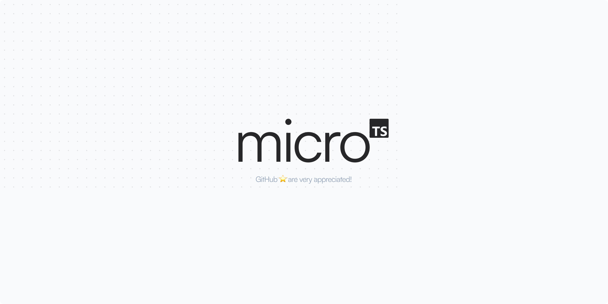

<p align="center" >
    
</p>
<br />
<p align="center" style="max-width:50%;margin:0 auto;">
  <code>micro-ts</code> A micro-minimalist template to create TypeScript packages with `microbundle`.
</p>
<br />

<a href="https://github.com/adevinwild/micro-ts/generate">
  <p align="center">
    <kbd>Start now ✨</kbd>
  </p>
</a>

## Features 🎉

-   Pre-configured `microbundle` repository 📦
-   Pre-configured `eslint` and `prettier` 🛠️
-   Pre-configured `jest` and `ts-jest` 🧪

## Usage 📖

You can clone the repository or click on the `Use this template` button to create a new repository from this template.

Start hacking inside the `src` folder and run `npm run build` to build the package.

## Publishing 🚀

While we haven't included a specific package for publishing your NPM package, we do have a few recommendations for you. If you want a simple and straightforward method for publishing your package, **we recommend using the [np](https://github.com/sindresorhus/np) package.**
The following command will guide you through the publishing process, and it is an easy way to publish your package.

```bash
npx np
```

## Configuration 🛠️

<kbd>micro-ts</kbd> is based on the `microbundle` package. You can find more information about the configuration [here](https://github.com/developit/microbundle).

The `package.json` file contains the following keys:

```

{
"name": "foo", // your package name
"type": "module",
"source": "src/foo.js", // your source code
"exports": {
"require": "./dist/foo.cjs", // used for require() in Node 12+
"default": "./dist/foo.modern.js" // where to generate the modern bundle (see below)
},
"main": "./dist/foo.cjs", // where to generate the CommonJS bundle
"module": "./dist/foo.module.js", // where to generate the ESM bundle
"unpkg": "./dist/foo.umd.js", // where to generate the UMD bundle (also aliased as "umd:main")
"scripts": {
"build": "microbundle", // compiles "source" to "main"/"module"/"unpkg"
"dev": "microbundle watch" // re-build when source files change
}
}

```

<small>This is a copy of the `microbundle` documentation.</small>

When you build your project using `microbundle`, three different file formats are generated:

-   <kbd>.umd.js</kbd>: A Universal Module Definition (UMD) file format that works in different module systems, including AMD, CommonJS, and global scripts.

-   <kbd>.module.js</kbd>: An ES module file format that uses the import and export syntax and is designed to work in modern browsers and build tools.

-   <kbd>.cjs</kbd>: A CommonJS module file format that uses the require and module.exports syntax and is used in Node.js and older JavaScript environments.

You can use these file formats to **target different environments**.

## License 📝

[MIT](./LICENSE)

<a href="https://github.com/adevinwild/micro-ts/generate">
  <p align="center">
    <kbd>Start now ✨</kbd>
  </p>
</a>
